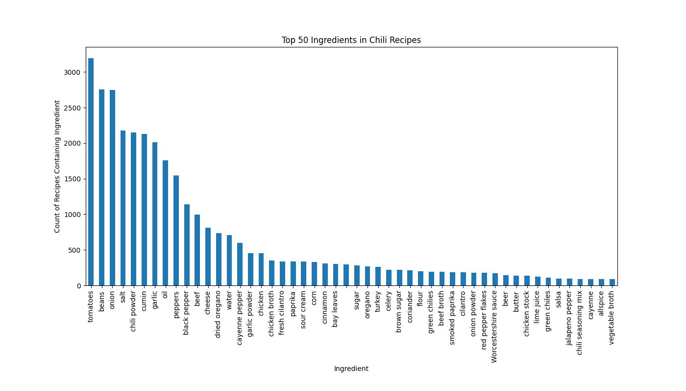

I scraped 3746 chili recipe from the web and analyzed their content to find out what chili is (according to people who post chili recipes on the web). 


## Process

These are the rough steps I followed:  

1. Crawl websites with Go [Colly](https://go-colly.org/docs/) library  and to collect whole pages with "chili" in the title or major headers
  - produced 33155 pages that mostly didn't end up containing recipes
2. Scrape recipes with Python [recipe-scrapers](https://github.com/hhursev/recipe-scrapers) library
  - succeeded on 3746 recipes
3. Apply Named Entity Recognition (NER) to the ingredients
  - followed [NER example](https://deepgram.com/learn/turning-recipes-into-data-with-named-entity-recognition)
  - used [Colab notebook](https://colab.research.google.com/drive/16QLMiyQpFxDc8qw64zYupsypy8BkywjB?usp=sharing) from article to generate [spaCy](https://spacy.io/usage/spacy-101) model
  - downloaded trained model to use inference on chili ingredients
4. Create visualizations from data

## What is included in Chili?

Most Chili recipes have 10-20 ingredients.


These are the ingredients that are used in the most recipes:



The nameless ingredient is due to a NER failure to identify any food. Examples of this problem  will be shown later.

Some of the most common ingredients are listed in many different ways in recipes, so they have been normalized a bit. For example, here are many ways to say onions:

<pre>
index                   food  count normalized
8                      onion    727      onion
27               large onion    326      onion
30              medium onion    288      onion
36                    onions    235      onion
47              yellow onion    184      onion
61             medium onions    125      onion
67               small onion    108      onion
79        large yellow onion     90      onion
87          medium red onion     86      onion
90                 red onion     84      onion
93       medium yellow onion     81      onion
101             large onions     76      onion
123              white onion     56      onion
160            yellow onions     41      onion
186        large white onion     33      onion
189       small yellow onion     32      onion
204          large red onion     29      onion
231  medium red yellow onion     25      onion
258        small white onion     22      onion
280              sweet onion     20      onion
330       medium white onion     17      onion
342      small yellow onions     16      onion
343               red onions     16      onion
364      large yellow onions     15      onion
365        large sweet onion     15      onion
</pre>

There is a difference in qualities (such as flavor and texture) between the different types of onions, peppers, cheeses, etc, so maybe later it is worth breaking down the variations of the top ingredients.

Chili recipes don't tend to have many types of beans. It seems that most people have determined that the type of bean doesn't matter much so they only use one type. I noticed this one where the author left it up to the reader:

> 4 1/2 cups dried beans (black beans, pinto beans, or great northern beans all work very well)


I like to add several bean types to add visual variety, but with canned beans this leads to a larger batch of chili. Maybe people prefer smaller batches.

## Improvement Opportunities

NER failed to identify anything as a food in about 400 ingredients. In the cases I viewed there was clearly food items that I could identify. These examples show chicken, cheese, Jalapeños, and chuck roast that the NER failed to identify as food:

``` python
[('2', 'QUANTITY'), ('lbs', 'UNIT'), ('.', ''), ('Chicken', ''), ('Breast', '')]

[('Cheese', '')]

[('Jalapeños', '')]

[('2', 'QUANTITY'), ('lb', 'UNIT'), ('.', 'UNIT'), ('(', ''), ('approx', ''), ('Chuck', ''), ('Roast', ''), (',', ''), ('cut', 'PROCESS'), ('into', 'PROCESS'), ('bite', 'PROCESS'), ('-', 'PROCESS'), ('sized', 'PROCESS'), ('cubes', 'PROCESS'), (')', '')]
```

## Clustering Ingredients

I tried a few different ways of clustering ingredients with unsupervised learning to see if it would reveal anything. It mostly grouped them by the units of measurements which did align them to categories that I might be interested in. For example, everything measured in teaspoons or tablespoons is some sort of flavoring such as a spice, salt, or herb.
I used TF-IDF as shown in this [skcikit learn clustering example](https://scikit-learn.org/1.5/auto_examples/text/plot_document_clustering.html#sphx-glr-auto-examples-text-plot-document-clustering-py) on the full ingredient lines to generate vectors with 3048 features, but then used LSA as shown in the same example to reduce it to 150 features that covered 78.9% of the variance. I also followed part of this [other skcikit learn clustering example](https://scikit-learn.org/1.5/auto_examples/cluster/plot_kmeans_digits.html#sphx-glr-auto-examples-cluster-plot-kmeans-digits-py) to project the features into a 2D space and create this visualization.  


It might be better more useful to just write a heuristic that groups ingredients into categories like "onions", "beans", "tomato", "flavorings", etc as was done for the bar graph.

## Next Steps

+ Categorize ingredients in some useful ways
  - It might be interesting to try something that takes into account the order of words since the bag of words model used ignores that
+ Get density information on, for example, beans to their weight quantities can be converted to volume
+ Explore ratios of ingredients such as volume of flavorings to total volume of recipe
+ Make a tree-map of ingredient categories sized based on volume averaged across several recipes
+ Maybe something in the instructional steps of the recipes could be interesting
  - Maybe certain techniques or the order of the steps could result in different flavors
