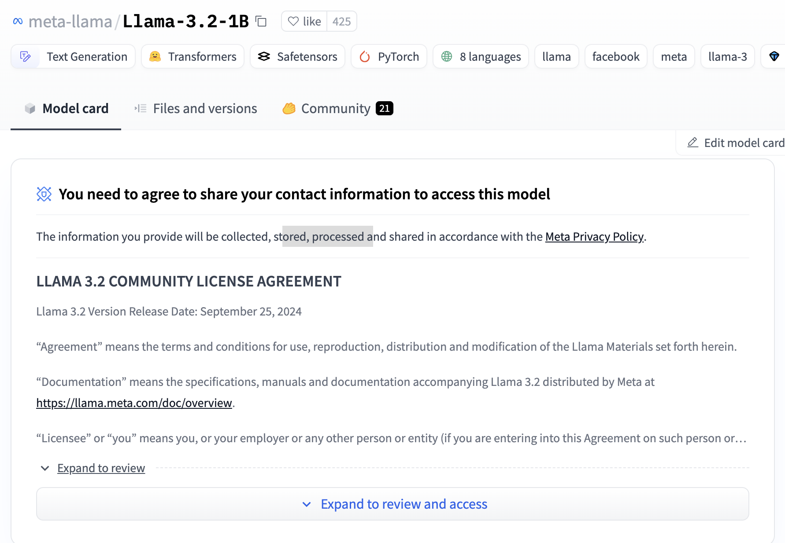

This is a step-by-step guide that explains how to get a Large Language Model (LLM) on your local machine and invoke it to perform inference from Python code.  

## Running a model from Hugging Face

Prerequisites: Python with pip, shell session

1. Sign up for Hugging Face account at [https://huggingface.co/join](https://huggingface.co/join).
2. Verify your email by clicking the link they send you and log in.
3. Find a model in the hub like [meta-llama/Llama-3.2-1B](https://huggingface.co/meta-llama/Llama-3.2-1B).
4. If it is a gated model, agree to terms and send the model publisher your personal information.

5. Wait for approval. This took less than 5 minutes for me.

6. Create a read access token in [(click account icon in top right of huggingface.co) > Settings > Access Tokens](https://huggingface.co/settings/tokens) and copy the token value to environment variable `HF_ACCESS_TOKEN` in your shell.

``` shell
export HF_ACCESS_TOKEN='<access token value>'
```

7. In your shell create a virtual environment and activate it.

``` shell
python -m venv .venv
. .venv/bin/activate
```

8. In your your shell install libraries.

``` shell
pip install transformers torch huggingface-hub accelerate
```

9. Copy the example code from the Model card tab in the Hugging Face site into a `tryLlama.py`file.

 ``` python
import torch
from transformers import pipeline

model_id = "meta-llama/Llama-3.2-1B"

pipe = pipeline(
    "text-generation", 
    model=model_id, 
    torch_dtype=torch.bfloat16, 
    device_map="auto"
)

pipe("The key to life is")
 
 ```

10. Add code to login and code to print the model output resulting in this complete file.

``` python
import os
from huggingface_hub import login
import torch
from transformers import pipeline

access_token = os.environ['HF_ACCESS_TOKEN']
login(token=access_token)

model_id = "meta-llama/Llama-3.2-1B"

pipe = pipeline(
    "text-generation",
    model=model_id,
    torch_dtype=torch.bfloat16,
    device_map="auto",
)

output = pipe("The key to life is")
print(output)

```
 
11. Run `python tryLlama.py` a couple times to see the different output it generates.

The first time it runs the model weights will be downloaded in a [safetensor format](https://huggingface.co/docs/safetensors/en/index) to `~/.cache/huggingface/`. It was 2.47 GB for the `meta-llama/Llama-3.2-1B` model.

## What else?

By default the output from the model is limited to a very short amount of text. Increase the amount of output the model can generate by passing this argument to `pipeline`:
```python
max_new_tokens=200,
```

The model I used here seems to respond slowly compared to other LLMs I've tried via web interfaces, such as [ChatGPT](https://chatgpt.com/) and [Claude](https://claude.ai/), or locally via [GPT4All](https://www.nomic.ai/gpt4all). It also doesn't respond to questions in a helpful conversational manner.

I assume that performance can be improved by choosing the correct model and configuring it properly. I've seen settings for some models to make it use a GPU instead of a CPU. Reading Meta's [Quantization How-To Guide](https://www.llama.com/docs/how-to-guides/quantization) might also help with performance.

I assume the responses can be made more helpful by choosing a model that is trained to be a helpful assistant. The diagram on the [Code Llama Integration Guide](https://www.llama.com/docs/integration-guides/meta-code-llama) suggests that certain models are fine tuned for certain behaviors like chat, instruct, or long contexts. It is not really clear exactly which Meta models are best for each purpose and the models you find on Hugging Face are not clearly marked with the type of tuning they've had. They all have the same generic text that describes the whole family of models.

The model I chose appears to be a base model that just extends the text you provide as if it is trying to finish you sentence. The ones with "instruct" in the name, such as `meta-llama/Llama-3.2-1B-Instruct`, appear to have instruction fine tuning that makes them respond as if they're another person having a conversation with you. 

I assume that the LLMs I use via other means have been given some prompting that is not visible to me and that proper prompting will make these models more useful. Meta's [Prompting How-To Guide](https://www.llama.com/docs/how-to-guides/prompting) or Anthropic's [Prompt Engineering](https://docs.anthropic.com/en/docs/build-with-claude/prompt-engineering/overview) should help.

It seems that using LLMs via web calls is more popular than running them locally. There are suggestions on to make them more viable on network edge computers (such as end-user devices), but I've also heard people suggest that there are "headwinds" making that more difficult. Clearly better results come from larger models ran on faster and/or specialized processors. Where will thet inference happen in the future? I suspect most inference will happen in the cloud because optimizing enough to run small efficient purpose-built models on edge computers is difficult. Google has invested in making [TPUs](https://en.wikipedia.org/wiki/Tensor_Processing_Unit) available in edge machines including their Pixel mobile devices. I wonder if there will be a market for specialized home servers to run model inference on local networks. It could provide lower latency for a more responsive experience. It could provide reduced costs if model inference as a service (MIaaS?) providers continue to charge a premium. There would be significant difficulty in creating a server that is easy to set up and getting app makers to use it. Maybe companies that provide network attached storage (NAS), home media server, or smart home hubs could provide home AI servers.

Anyhow, I think app creators will have a challenge figuring out where to run model inference performantly and cost-effectively.

