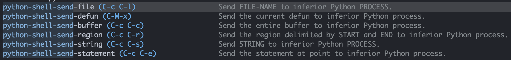

Both Emacs and VSCode let you run a Python REPL and send code from files to the REPL. They both allow the REPL to use the virtual environment (venv) that you want. But they both make it cumbersome to use multiple venvs.

## Doom Emacs Python environment

Vanilla GNU Emacs provides some Python capabilities. It is difficult to know what behavior comes from GNU Emacs and what has been added by Doom.

Annoyingly the buffer that opens in `Inferior Python` mode is sometimes called a shell and sometimes called a REPL.

It can be started by `run-python` or `python/open-repl`.

Lines in the current buffer at the current point can be sent to the REPL with `python-shell-send-statement`.

Here are all the commands that can send code to the REPL:



### Usng a virtual environment
If you've installed your Python packages in a virtual environment (venv) then the Python REPL won't be able to find them. If you run `pyvenv-activate`, select a venv, and hen run `python-shell-restart` the Python REPL will be able to find your installed packages in the venv you selected.

You can see the venv indicated in the modeline of the REPL buffer and the code file buffers, but only when those buffers have focus. It doesn't seem to matter which buffer had focus when the activation occured. 

It doesn't appear to be possible to use more than one venv at a time so using different projects will require switching the venv. Providing the universal argument to `run-python` makes it prompt to ask if you want to dedicate a process to the buffer or project, but it doesn't seem to work.

## VSCode Python environment

The Python extension for VSCode provides a Python REPL that can be started with the `Python: Start Native Python Repl` command or by the `Python: Run Selection/Line in Python REPL` command that send a line to the REPL. The default shortcut for the command is `Shift + Enter`.

The REPL seems to get stuck on one venv, so you can't use mutiple venvs in the same workspace. There is a `Python: Select Interpreter` command that lets you choose the venv directory, but it doesn't seem to work.

The best way to use a different venv seems to be launching a new instance of VSCode by running `code .` in a shell with current directory set to the root directory of the project that you want to run the new venv in.

## Troubleshooting

Run this in a script or REPL to see the paths where it will look for packages:
``` python
import sys; print(sys.path)
```
For the scirpt or REPL to find the packages installed in thet venv,  the list should include the subdirectory of the venv's directory where the packages are isntalled, for example, `<venv directory>/lib/python3.12/site-packages`.
 
