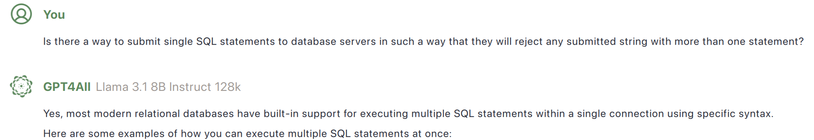

These are some rather stupid responses I've gotten from large language models (LLMs). They highlight the inadequacies of LLMs as a source of useful and valid information. Maybe they also make me feel better about the prospects of LLMs eliminating jobs.

For this one I was trying to figure out if databases could reject multiple SQL statements when they should be expecting only one statement per submission. The LLM proceeded to show me many examples of using semi-colons to separate multiple statements.

